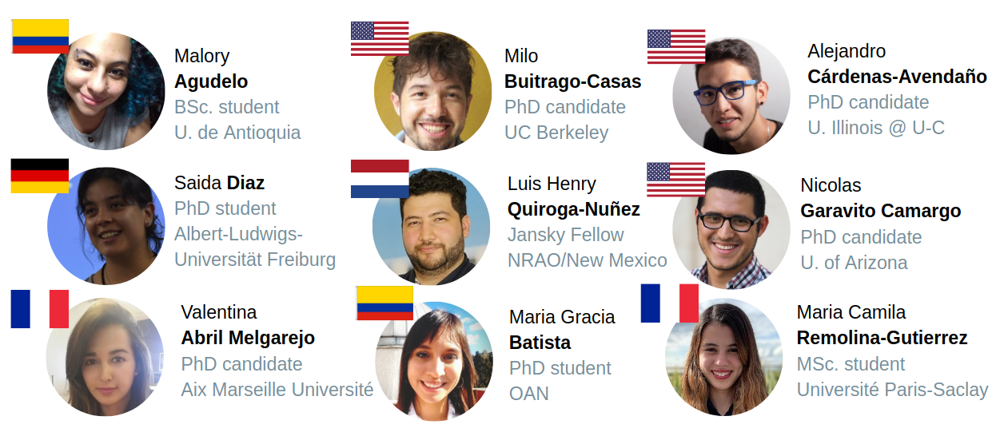

El comité coordinador del programa está conformado por estudiantes y postdocs en
astronomía. En 2020 el comité estuvo conformado por: 

El comité se encarga de organizar y estructurar el Programa de mentores. Organiza los
paneles y las convocatorias de mentores y mentorados. 

 

